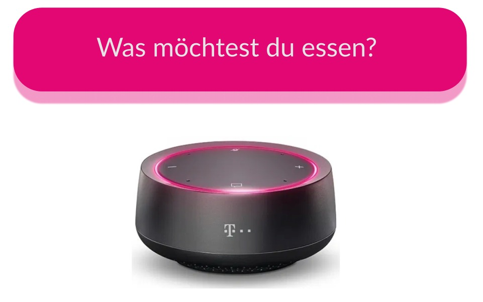

# foodBot

foodBot is a concierge powered by the Magenta voice assistant who brings you your daily lunch at the right time.

## Steps
- Fill out your profile with your lieferando account details and preferred restaurants and menu. (one time) * Future.
- Tell FoodBot you are hungry
  - Ich habe hunger
  - Ich möchte essen bestellen
- FoodBot searches for the nearest restaurants and asks you to choose from 3 restaurants
- Say your option. FoodBot orders menu of the day from your choice